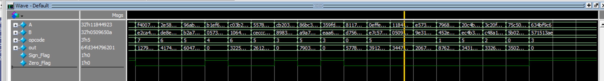

# 🧠 Arithmitic Logic Unit (ALU)  

This project implements an **ALU**. The design is written in *Verilog HDL*, tested with **QuestaSim**.

--- 

## 📚 Table of Contents  

- [Project Features](#-project-features)
- [Folder Structure](#-folder-structure)
- [Testbench & Simulation](#-testbench--simulation)
- [Tools Used](#-tools-used)
- [How to Run](#-how-to-run)
- [Author](#-author)
- [Notes](#-notes)  

---  

## 📌 Project Features  

- Supports Arithmitic operations like(Add, Sub, Multi)
- Supports Logical operations like(Reduction AND Gate on A, Bitwise XOR Gate)
- Supports Shift operations (sh to *right*, sh to *left*)
- Supports Flags (Sign_Flag, Zero_Flag)
- Tested via *Testbench & Simulation*

--- 

## 📁 Folder Structure

| Folder      | Description                                                                      |
|-------------|----------------------------------------------------------------------------------|
| RTL/        | Verilog HDL file for the design (AlU.v)                                          |
| TB/         | Testbench file for simulation (ALU_TB.v)                                         |
| Simulation/ | .do file and simulation scripts for QuestaSim                                    |
| Docs/       | screenshot of the waveform, and simulation output                                |

---

## 🧪 Testbench and Simulation  

- ALU_TB.v : tests each case of our ALU for (out, Sign_Flag, Zero_Flag)

### ✅ ALU Testbench Output 

### ✅ Waveform

--- 

## 🛠 Tools Used  

- *Verilog HDL*
- *QuestaSim* for simulation

---

## 📥 How to Run 

### 🔬 Simulation:

- Open **QuestaSim**
- Navigate to the `transcript`
- Run using .do file write `do ALU.do` to compile and simulate

---

## 👨‍💻 Author

**Kareem Ashraf**
Electronics and Electrical Communications Engineering, Cairo University
📧 **Email**    : [kareem.ash05@gmail.com]  
🔗 **Linkedin** : [www.linkedin.com/in/kareem-ashraf-9aba48348]   
🔗 **GitHub**   : [https://github.com/kareem05-ash]

---

## 📌 Notes

This project was part of my **Self-learning Journey**
